# TaskBoardPolicy

This document describes the `insert_cable` vision policy in `ros_ws/src/aic_policy_ros/aic_policy_ros/ros/TaskBoardPolicy.py`. Multiview vision is implemented by `TaskBoardVision` (`task_board_vision.py`), which delegates the geometric core to `RectangleVision` in the sibling checkout `ai-industry-challenge` (`vision/rectangle_vision.py`). After `MultiviewSnapshot.apply` decodes the three full-resolution views, **`TaskBoardVision`** applies **`ImageScaler(0.25)`** (`INTER_AREA`) **from independent copies** of that full BGR: **`_bgr_quarter_views`** builds the tensors for **`RectangleVision`** at quarter resolution (**§1.2**, **§3.2**, **§5.2**), while **§1.3**, **§3.3**, and **§5.3** (*Rectangle Segmentation*) cover HSV preview dumps, thresholding and post-processing, boolean masks, and policy-written mask copies. **`_dump_scaled_hsv_turbo_multiview`** / **`_dump_scaled_hsv_h_turbo_multiview`** write quarter-res HSV preview PNGs only (see **HSV V Turbo** / **HSV H Turbo** within those sections). In source order, each phase that runs **`RectangleVision`** calls the relevant HSV dump helper **before** `_bgr_quarter_views`; the preview arrays are not shared with the vision path. The third snapshot (**§5**) uses **`_dump_scaled_hsv_h_turbo_multiview`** only (no V-turbo dump on that phase). `RectangleVisionInput.image_scale` is **1.0**, so the classifier consumes those masks as-is (no extra mask resize after segmentation). When `dump_layout="episode_cameras"`, each `RectangleClassifier` run also writes **trajectory** CSV and a four-panel PNG under `multiview/<observation_id>/<yaw_slug>/`.

ROS parameter on the parent `aic_model` node:

| Parameter    | Default | Role |
|--------------|---------|------|
| `episode_id` | `0`     | Episode index for dump paths and for `trial_{episode_id}.yaml` table height used in vision geometry. |

PNG dumps default to `output_root=/tmp/aic-policy` (constructor argument on `TaskBoardVision`, not a ROS parameter). The per-episode directory is `episode_{episode_id}` unless overridden by `AIC_SEG_EPISODE_ID` or `AIC_SEG_TRIAL_ID`. The policy calls `get_observation()` for the first frame, again after the first move, and expects `left_image`, `center_image`, `right_image`, and matching `CameraInfo` fields on `aic_model_interfaces/msg/Observation`. After `second_action`, `insert_cable` calls `TaskBoardVision.third_observation()`, which compares full-res MD5s against the second snapshot so cameras that still match the second frame can trigger a short yield and one retry, mirroring `second_observation`, then runs **`RectangleVision`** with **`SegmentationMode.BLUE_SC_PORT`** (see **§5**).

`RectangleVision` can write debug assets when `dump_dir` and `dump_layout="episode_cameras"` are set; this policy passes `observation_dump_id=1` for the dark board pass, `2` for the intrinsics-logo pass, and **`3`** for the blue-port pass, so assets appear under `{camera}/{1|2|3}/{yaw_pi|yaw_pi2}/` plus `multiview/{1|2|3}/…` and, after the second pass, `second_observation_task_board_xy_top_view.png` at the episode root when orientation classification runs.

Figures below use **`doc/img/episode_1/…`**, mirroring **`/tmp/aic-policy/episode_1`** (same tree as a live policy dump). Regenerate with `RVIZ=false ./scripts/launch_trial_with_policy.sh <id>`, then `cp -a /tmp/aic-policy/episode_<id> doc/img/`. Swap `episode_1` in the paths if you vendor a different episode.

---

# 1. First Observation: Dark Task Board

Segmentation mode: `SegmentationMode.DARK_TASK_BOARD` (`vision.rectangle_segmentation`).

## 1.1 Full resolution image in BGR

`MultiviewSnapshot` decodes each `sensor_msgs/Image` to BGR (`uint8`, `H×W×3`) and writes full-resolution PNGs:

- `{output_root}/episode_*/left_camera/input/first_observation_bgr.png`
- `{output_root}/episode_*/center_camera/input/first_observation_bgr.png`
- `{output_root}/episode_*/right_camera/input/first_observation_bgr.png`

| Left | Center | Right |
|------|--------|-------|
|  | 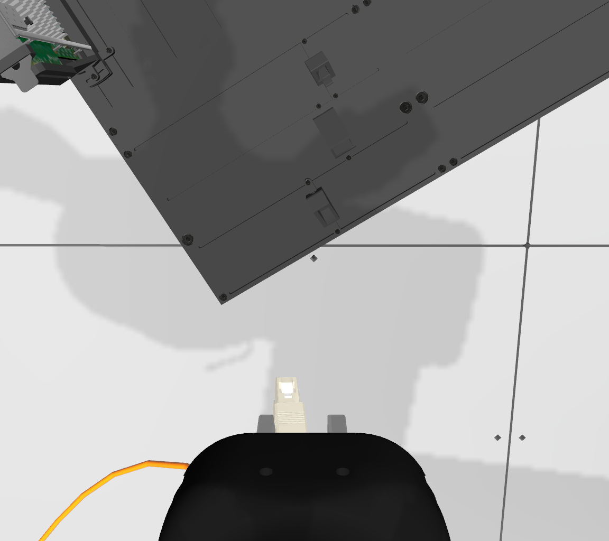 |  |

## 1.2 Downscaling

In `first_observation`, **`_bgr_quarter_views`** runs **after** `_dump_scaled_hsv_turbo_multiview` in source order; both read the same in-memory full BGR from `MultiviewSnapshot.apply` and each apply **`ImageScaler(0.25)`** independently.

`_bgr_quarter_views` feeds **`RectangleVision`**: segmentation and the rectangle fit see **one quarter** the linear resolution of the saved `first_observation_bgr.png` files. `RectangleVisionInput.image_scale` is **1.0**, so the boolean masks fed to `RectangleInitializer` and `RectangleClassifier` match `segmentation_mask_<camera>.png` in the dump tree; **`segmentation_mask_downscaled_<camera>.png` is not written** when it would duplicate that file.

| Left | Center | Right |
|------|--------|-------|
| 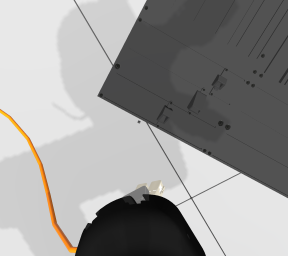 | 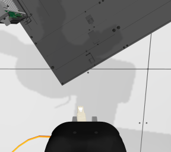 | 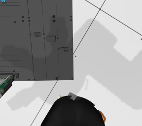 |

## 1.3 Rectangle Segmentation

`RectangleVision` runs dark-board segmentation on the quarter BGR from **§1.2**.

### HSV V Turbo

`TaskBoardVision._dump_scaled_hsv_turbo_multiview` resizes each **full** BGR view with `ImageScaler(0.25)` (preview only), converts with `BgrToHsvConverter`, maps the **V** channel through OpenCV `COLORMAP_TURBO`, and writes `first_observation_hsv_turbo.png` (and a raw three-channel HSV PNG) next to each BGR dump. The dark-board segmenter uses the **value** band in HSV space on the **quarter BGR** passed to `RectangleVision`; this dump is a human-readable intensity view at the same linear scale as that input (both use `0.25` from full resolution).

| Left | Center | Right |
|------|--------|-------|
| 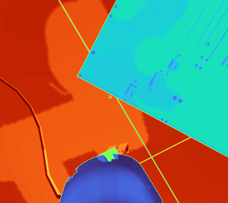 | 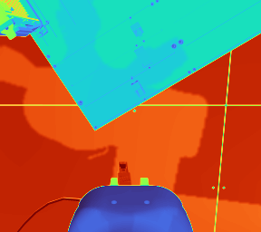 | 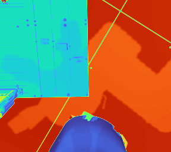 |

### V thresholding + post-processing before the segmentation masks

`SegmentationMode.DARK_TASK_BOARD` thresholds the **V** (value) channel in HSV into a dark-board band, then runs connected-component selection and morphological post-processing so the boolean masks below match what `RectangleVision` feeds to the initializer and classifier.

Policy-written `input/first_observation_task_board_mask.png` files are the masks from the **first** yaw seed’s run.

| Left | Center | Right |
|------|--------|-------|
| 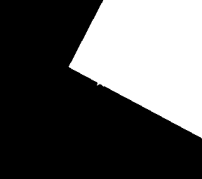 | 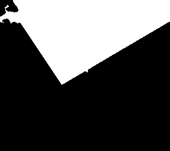 | 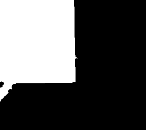 |

## 1.4 Rectangle Initializer

`RectangleInitializer.candidate_xy_from_masks_on_z_table` takes the three **boolean** masks at the segmentation resolution, nominal intrinsics `K` at that resolution (`nominal_basler_K_for_image_wh` in `rectangle_vision.py`), wrist transforms `T_cam_from_base`, and table-plane height `z_face_in_base()` from `task_board_episode_geometry`. It ray-casts masked pixels to the table plane, forms a centroid per camera, and averages them into `(cx, cy)` in `base_link`. Calibration from the live `Observation` is read for JSON dumps (`MultiviewCameraInfo` / `dump_multiview_calibration_json`); **`T_cam_from_base` is resolved from TF only** in `_resolve_multiview_cam_extrinsics` (see :mod:`aic_policy_ros.wrist_extrinsics_testing_matrices` for nominal episode‑0 matrices used in tests and YAML tooling).

**Plane `z` for initializer rays and footprint chart:** **`z_face_in_base()`** — the scalar **`TASK_BOARD_TOP_FACE_AABB` `z_top`** from :data:`vision.rectangle3d_detector.TASK_BOARD_TOP_FACE_AABB` (nominal board top face in the URDF board frame, **0.012 m**), passed through to `RectangleVisionInput.z_face_in_base` as the horizontal intersection plane in **base_link** for both centroiding and the dump below.

**Extrinsics:** per-camera **`T_cam_from_base`** from **`t_cam_from_base_by_camera_from_tf_buffer`** (`_resolve_multiview_cam_extrinsics(observation, "first")`); numeric matrices are in **`first_observation_extrinsics.json`** with the TF lookup source string from `task_board_vision`.

**Initializer-only top view** (Matplotlib): same mask-boundary → `z = z_face_in_base` back-projection as `xy_top_view_visible_by_camera.png`, but **no** fitted-rectangle outline. Overlays **`RectangleInitializer` merged** planar centroid (`merged_centroid_x_m` / `merged_centroid_y_m`: mean of the per-camera mask centroids on `z_face`, same as the classifier translation init) as a **magenta ×**. One file per observation id under `multiview/<id>/` (**overwritten** on each initializer-yaw pass, so the checked-in snapshot reflects the **last** seed, typically **π/2**): **`multiview/1/xy_top_view_initializer_footprints_only.png`**.

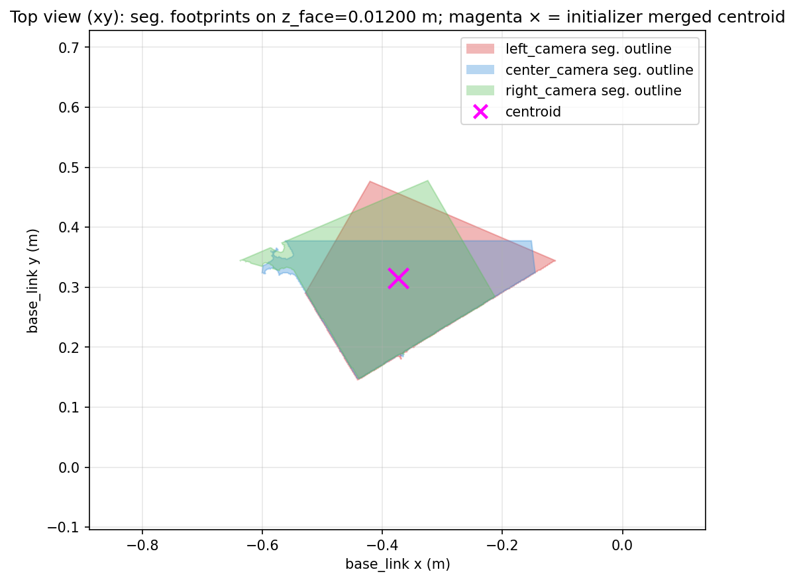

## 1.5 Rectangle Classifier

`RectangleClassifier.fit_multiview_shared_board_rectangle` optimizes a single shared rectangle in `base_link` for each yaw seed. The policy uses `_YAW_SEEDS_RAD = (π, π/2)` and runs `RectangleVision.run` twice, producing two `TaskBoardRectangleCandidate` values (each with `mean_hard_iou`). Default rectangle half-extents come from the URDF top face (`TASK_BOARD_TOP_FACE_AABB`) when logo-specific extents are not set.

Multiview footprint and fitted rectangle in the table plane (dump `xy_top_view_visible_by_camera.png`) for each yaw initializer:

| yaw seed = π | yaw seed = π/2 |
|----------------|----------------|
| 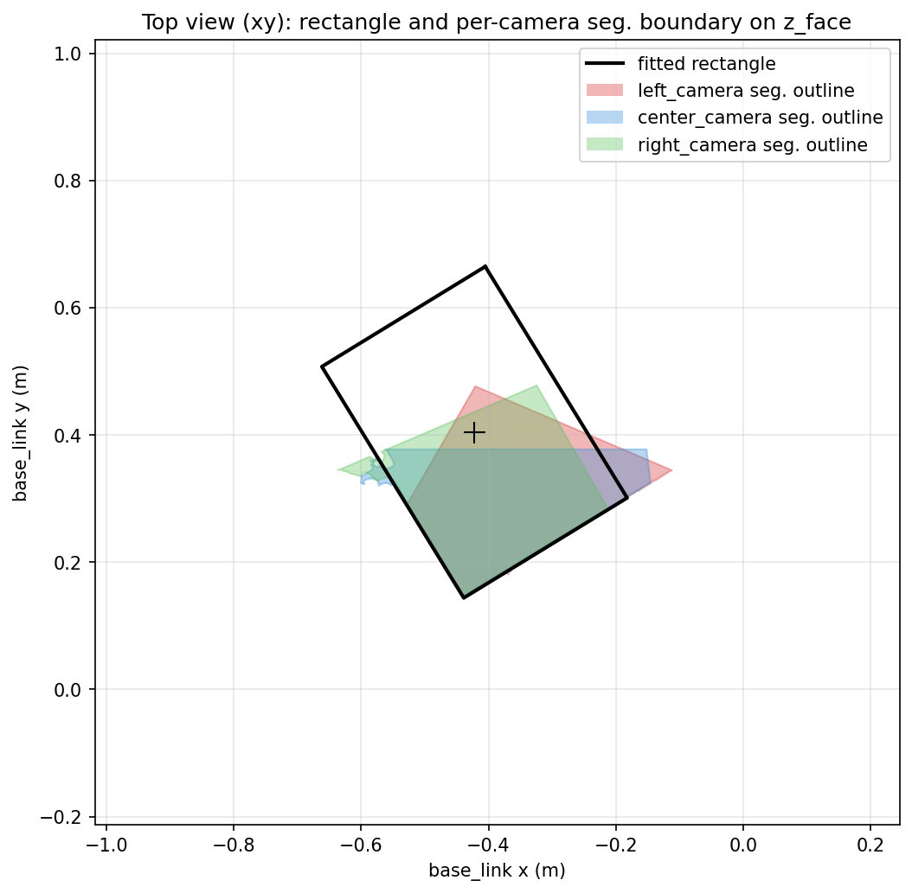 | 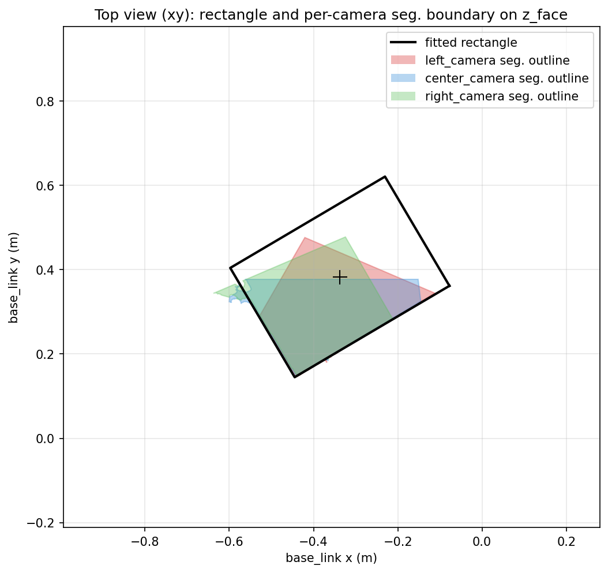 |

Center camera overlays (`rectangle_backprojection_<camera>.png`, yellow outline on the **quarter** BGR passed to `RectangleVision`):

| | yaw seed = π | yaw seed = π/2 |
|--|--------------|----------------|
| Left | 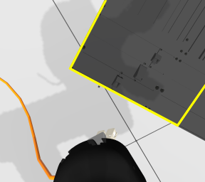 | 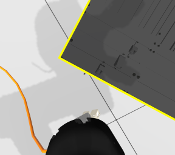 |
| Center | 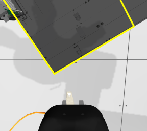 | 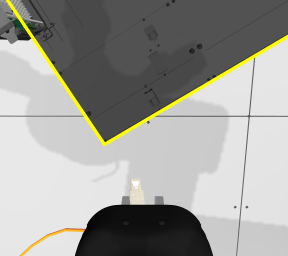 |
| Right | 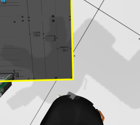 | 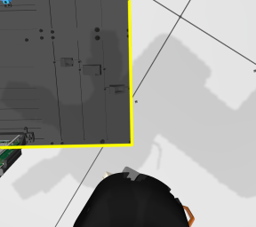 |

## 1.6 Classifier optimization trajectory

For each combination of **observation dump id** (`1` = dark board, `2` = intrinsics logo) and **yaw initializer** (`yaw_pi`, `yaw_pi2`), `RectangleVision` records every Adam iteration into `multiview/<id>/<yaw_slug>/rectangle_classifier_trajectory.csv` (columns `step`, `cx_m`, `cy_m`, `yaw_rad`, `loss`) and `rectangle_classifier_trajectory.png`. Each row is written **after** `optimizer.step`: **cx_m**, **cy_m**, **yaw_rad** are the decoded planar pose at the updated parameters; **loss** is the mean over cameras of the soft **1 − IoU** from the **forward pass** that immediately preceded that step (the scalar that was backpropagated).

| yaw seed = π | yaw seed = π/2 |
|----------------|----------------|
| 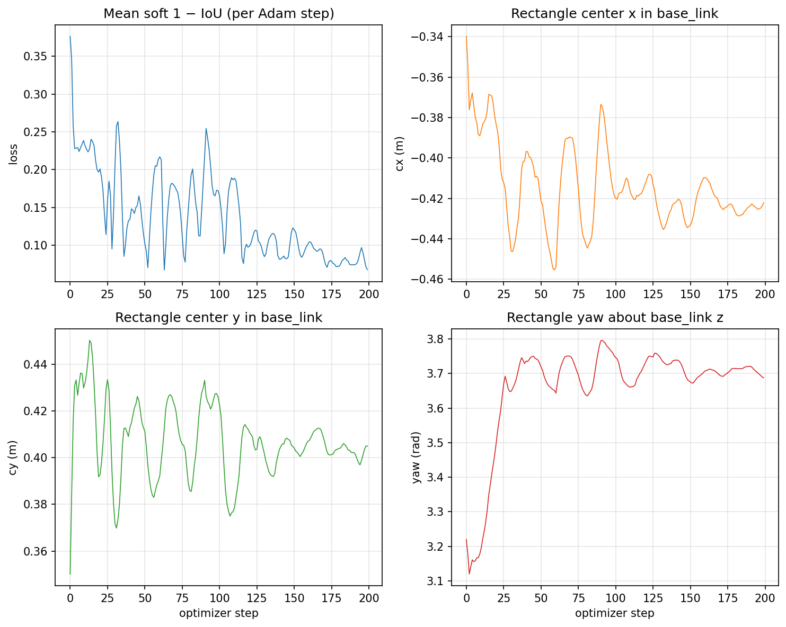 | 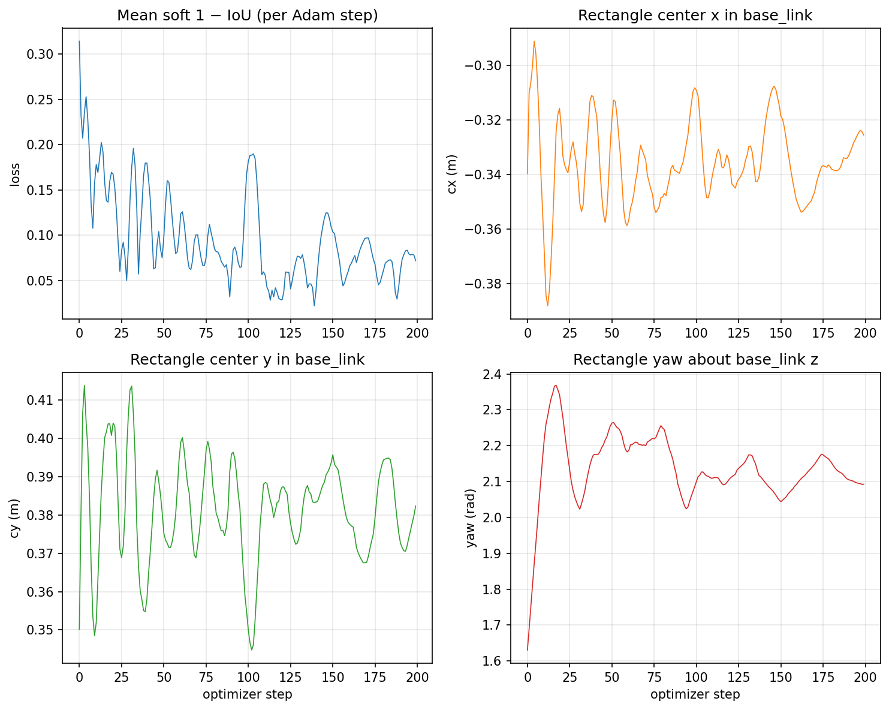 |

---

# 2. First Action

## 2.1 Move to the center of the Task Board

`TaskBoardControl.first_action` records the episode-start TCP pose, runs `LinkTransform` (`base_link` → `gripper/tcp`) for `initialize_tcp_z_m`, then `CartesianPositionMove` / `TaskBoardCenterMove`. The rectangle candidate with the **largest** `mean_hard_iou` is chosen (tie-break: lower index). `TaskBoardCenterMove` commands the gripper to the fitted `(cx_m, cy_m)` at that height, aligns planar yaw to `yaw_rad`, and polls TF until position and yaw tolerances are met or a time budget elapses, then the policy takes the **second** observation.

---

# 3. Second Observation: Purple Intrinsics Logo

Segmentation mode: `SegmentationMode.PURPLE_INTRINSICS_LOGO` (magenta **hue** band, largest connected component, same morphology defaults as the board path). The pipeline matches section **1**: **§3.2** downscaling, **§3.3** rectangle segmentation (HSV preview, **H** thresholding, masks), then initializer, classifier, and trajectory dumps—with **`rectangle_half_extent_x_m` / `rectangle_half_extent_y_m` set to 0.05 m** (10 cm × 10 cm logo in the plane).

## 3.1 Full resolution image in BGR

`second_observation_bgr.png` per camera after extrinsics JSON (`second_observation_extrinsics.json`; intrinsics are not rewritten).

| Left | Center | Right |
|------|--------|-------|
| 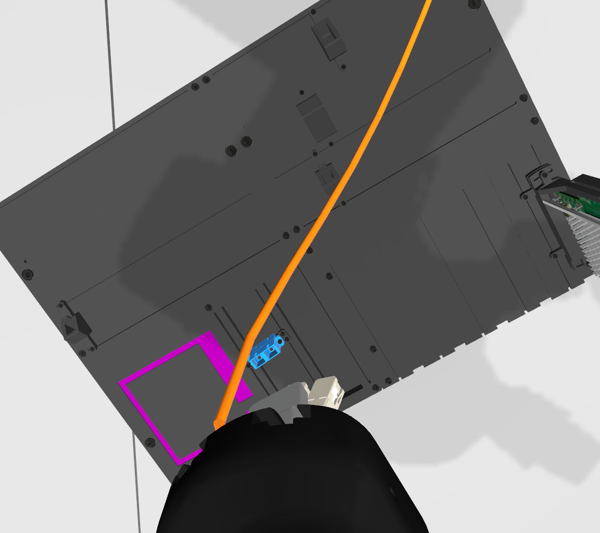 | 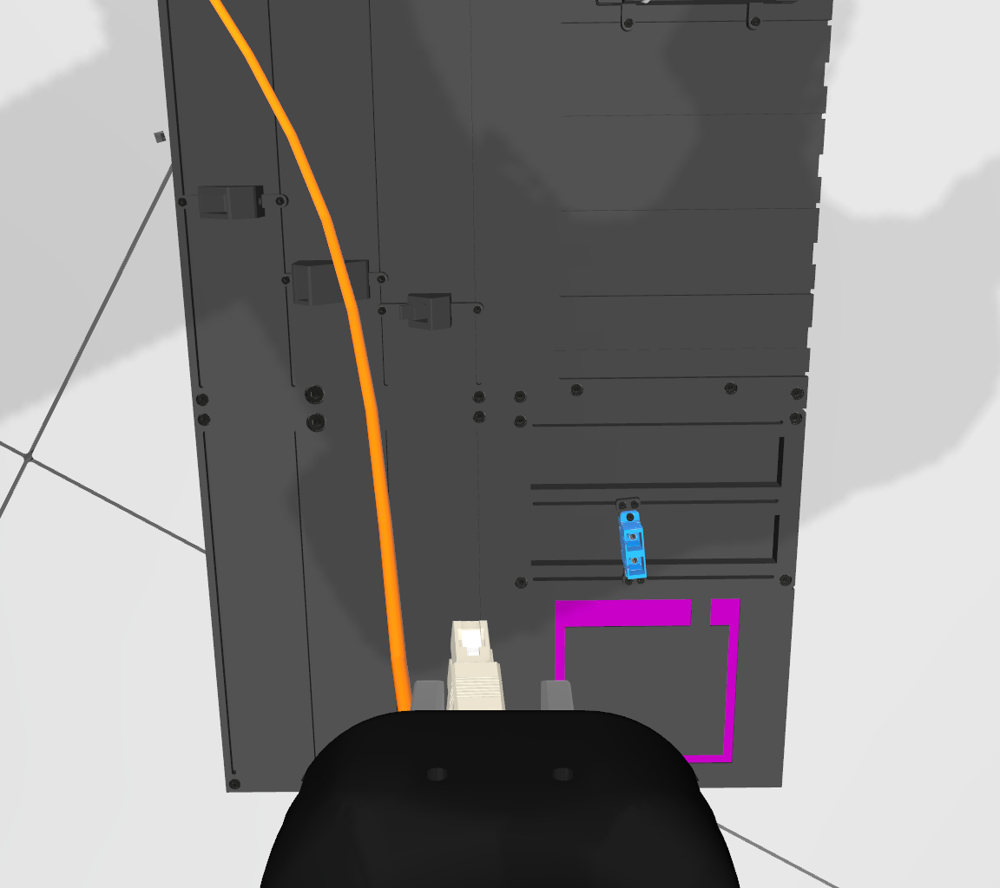 |  |

## 3.2 Downscaling

Same ordering as section **1.2**: `_dump_scaled_hsv_h_turbo_multiview` runs before `_bgr_quarter_views` in `second_observation`, each scaling independently from the full snapshot. Quarter BGR into `RectangleVision` (`original_<camera>.png` under observation `2`). With `image_scale=1.0`, only `segmentation_mask_<camera>.png` is emitted for the mask (no redundant `segmentation_mask_downscaled_<camera>.png`).

| Left | Center | Right |
|------|--------|-------|
| 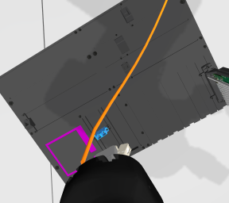 | 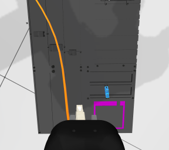 | 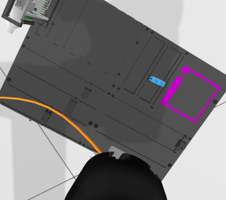 |

## 3.3 Rectangle Segmentation

`RectangleVision` runs intrinsics-logo segmentation on the quarter BGR from **§3.2**.

### HSV H Turbo

`TaskBoardVision._dump_scaled_hsv_h_turbo_multiview` builds the same quarter-res HSV preview pattern as the **HSV V Turbo** subsection of section **1.3**, but maps the **H** channel (OpenCV range **0–179**) to **0–255** and applies `COLORMAP_TURBO`, writing `second_observation_hsv_h_turbo.png` beside each BGR dump. Purple intrinsics logo segmentation is driven by **hue** on the quarter BGR passed to `RectangleVision`; this preview matches that scale (still **0.25** from full resolution for file size).

| Left | Center | Right |
|------|--------|-------|
| 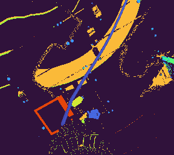 | 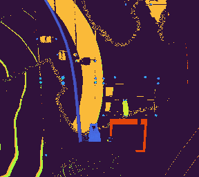 | 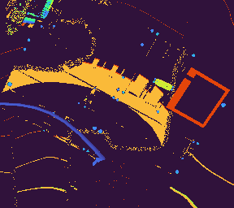 |

### H thresholding + post-processing before the segmentation masks

`SegmentationMode.PURPLE_INTRINSICS_LOGO` thresholds the **H** (hue) channel for the magenta logo band, then runs connected-component selection and morphological post-processing so the boolean masks below match what `RectangleVision` feeds to the initializer and classifier.

Policy-written `input/second_observation_intrinsics_logo_mask.png` files are the masks from the **first** yaw seed’s run on the logo pass.

| Left | Center | Right |
|------|--------|-------|
| 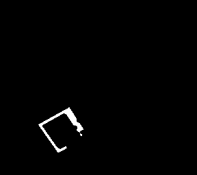 | 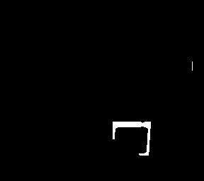 | 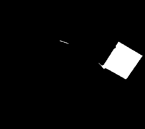 |

## 3.4 Rectangle Initializer

Same `RectangleInitializer` table-plane centroid merge as section **1.4**, using logo masks and the second-observation extrinsics.

**Plane `z`:** **`z_face_in_base()`** (same nominal board top as section **1.4**).

**Extrinsics:** **`T_cam_from_base`** from `_resolve_multiview_cam_extrinsics(observation, "second")` → **`second_observation_extrinsics.json`**.

**Initializer-only top view:** **`multiview/2/xy_top_view_initializer_footprints_only.png`** (footprints + magenta × = initializer **merged** centroid on `z_face`; last yaw overwrites).

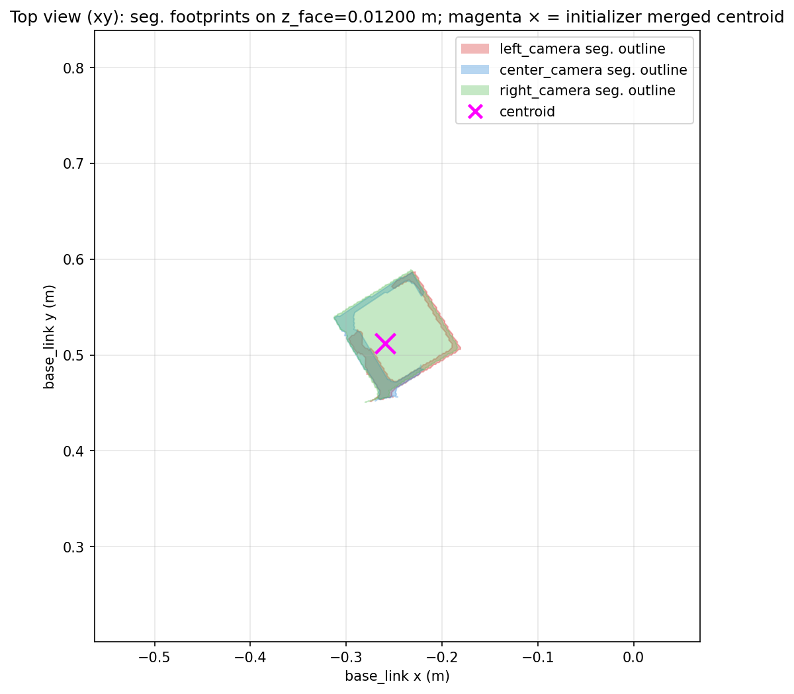

## 3.5 Rectangle Classifier

Same two-pass `RectangleClassifier` fit with **0.05 m** half-extents on both axes (printed intrinsics logo size).

Multiview footprint and fitted rectangle in the table plane (dump `xy_top_view_visible_by_camera.png`) for each yaw initializer:

| yaw seed = π | yaw seed = π/2 |
|----------------|----------------|
| 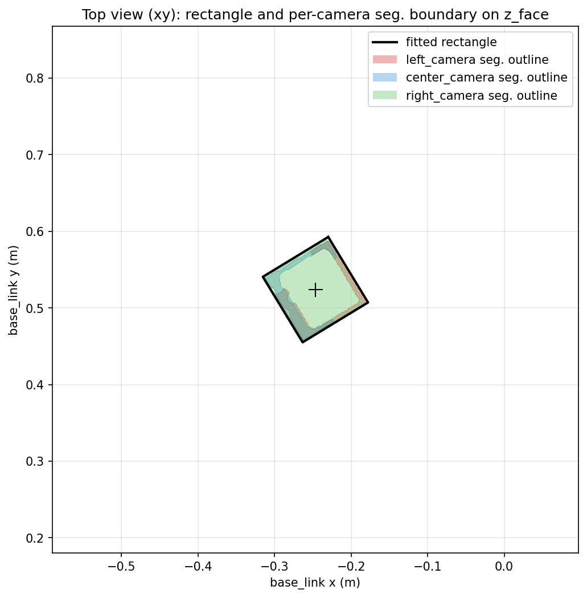 |  |

| | yaw seed = π | yaw seed = π/2 |
|--|--------------|----------------|
| Left | 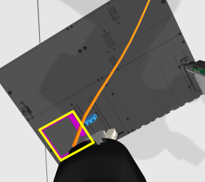 |  |
| Center |  | 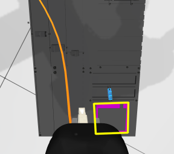 |
| Right |  | 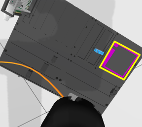 |

## 3.6 Classifier optimization trajectory

Same trajectory dump layout as section **1.6**, under `multiview/2/<yaw_slug>/`.

| yaw seed = π | yaw seed = π/2 |
|----------------|----------------|
| 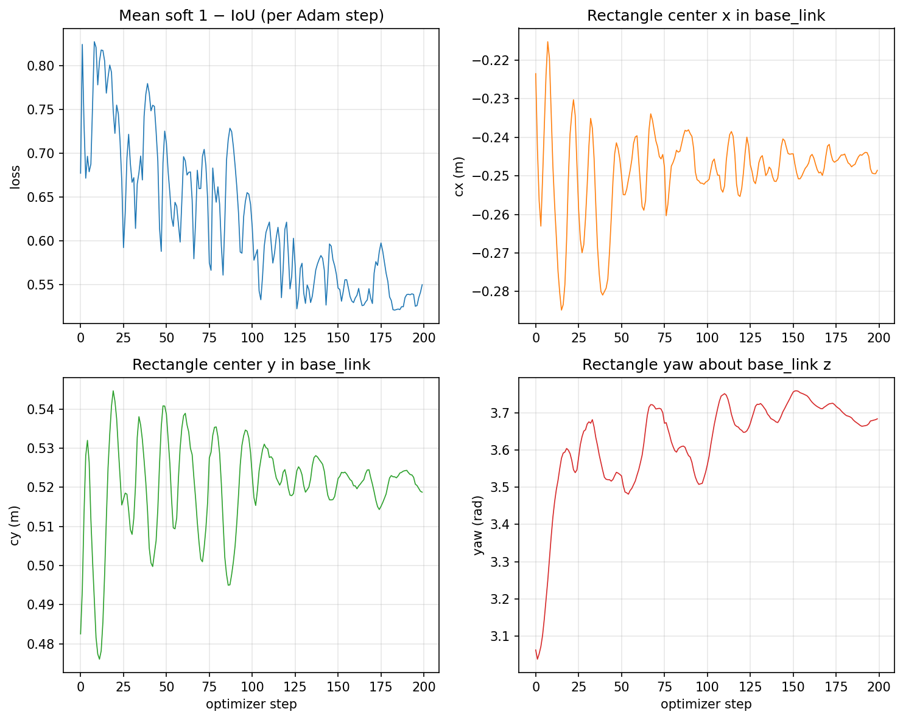 | 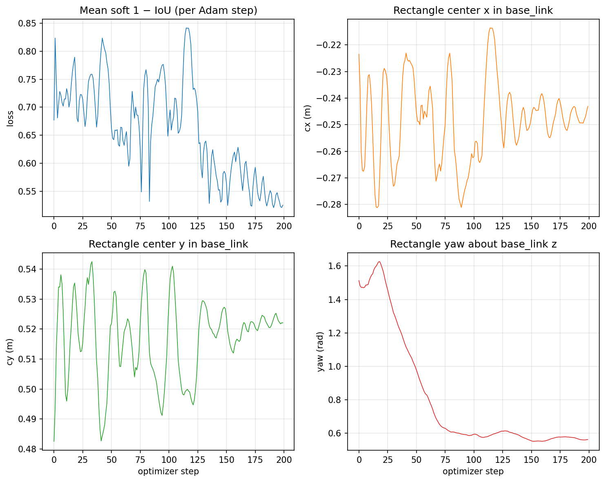 |

`TaskBoardOrientation.classify_from_fit_pairs` compares the first-observation board fits to the second-observation logo fits and writes a combined **base_link** XY top view (meters on horizontal axes) when state is available:

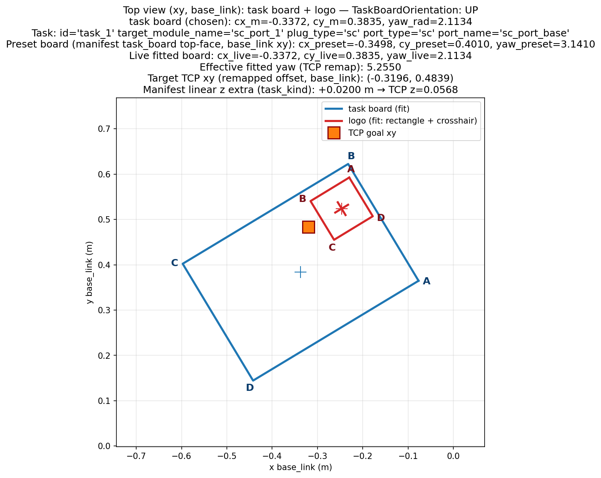

The policy stores `last_planar_board_cx_m`, `last_planar_board_cy_m`, and `last_planar_board_yaw_rad` from that classification (with fallbacks documented in `task_board_vision.py`).

---

# 4. Second Action

## 4.1 Move to the task specific pre-insert position in the middle of the rail

`TaskBoardControl.second_action` loads `task_manifest.json`, selects the row for the current `Task` and `episode_id`, and requires `trial_key` plus a full `task_board.pose`. It remaps `final_tcp_offset` with the vision `TaskPresetMiddlePoseTransform` (board-local xy, orientation, and episode-start TCP anchor), applies the same manifest linear z bump and live-board yaw delta as the planar helper (`tcp_manifest_linear_z_extra_m`, `quat_goal_xyzw_with_live_board_yaw_delta`), then issues one `set_pose_target` with the same stiffness and damping pattern as the centering move.

If there is no manifest row, the row is incomplete, or the vision remap fails, `second_action` is skipped with a warning (no fallback TCP goal path).

---

# 5. Third Observation: Blue SC Port (H band 94–111)

Segmentation mode: `SegmentationMode.BLUE_SC_PORT` (`vision.rectangle_segmentation`, preset **`BLUE_SC_PORT_FILTER`**: **H-only** band **`h_min=94`**, **`h_max=111`** in OpenCV hue (0–179; tuned from a Segment-Anything mask on episode 1 center `third_observation_bgr`); **S** and **V** are not gated (defaults span the full range). Same morphology and connected-component path as the logo preset. The pipeline matches section **3**: **§5.2** downscaling, **§5.3** rectangle segmentation (HSV **H** preview, **H** thresholding on quarter BGR, masks), then initializer, classifier, and trajectory dumps—with **`rectangle_half_extent_x_m` / `rectangle_half_extent_y_m` from** :func:`vision.rectangle3d_detector.sc_port_rectangle_half_extents_xy_m` (**≈ 1.37 cm × 0.46 cm** half-extents from :data:`vision.rectangle3d_detector.SC_PORT_FOA_MESH_AABB`, **27.43 mm × 9.27 mm** full width/depth along **x, y**). The **`z_face_in_base`** passed to `RectangleVision` is **`z_face_in_base()`** from `task_board_episode_geometry`—the **same** nominal task-board top plane as observations **1** and **2** (:data:`vision.rectangle3d_detector.TASK_BOARD_TOP_FACE_AABB` **`z_top`**). **No** SC FOA mesh **z** stack is added: the visible blue can lie on port side faces, so the ray–plane intersection uses the **board** top **z** only. Wrist **`T_cam_from_base`** for the third pass comes **only from TF** (same lookup convention as observations **1** and **2**); `dump_multiview_calibration_json` writes **`third_observation_extrinsics.json`** per camera. Nominal episode‑0 matrices for tests / YAML helpers live in :mod:`aic_policy_ros.wrist_extrinsics_testing_matrices` (**`T_CAM_FROM_BASE_BY_CAMERA_THIRD_OBSERVATION`** is provided there; intrinsics dumps are not rewritten).

## 5.1 Full resolution image in BGR

`MultiviewSnapshot` decodes each `sensor_msgs/Image` to BGR and writes full-resolution PNGs:

- `{output_root}/episode_*/left_camera/input/third_observation_bgr.png`
- `{output_root}/episode_*/center_camera/input/third_observation_bgr.png`
- `{output_root}/episode_*/right_camera/input/third_observation_bgr.png`

| Left | Center | Right |
|------|--------|-------|
| 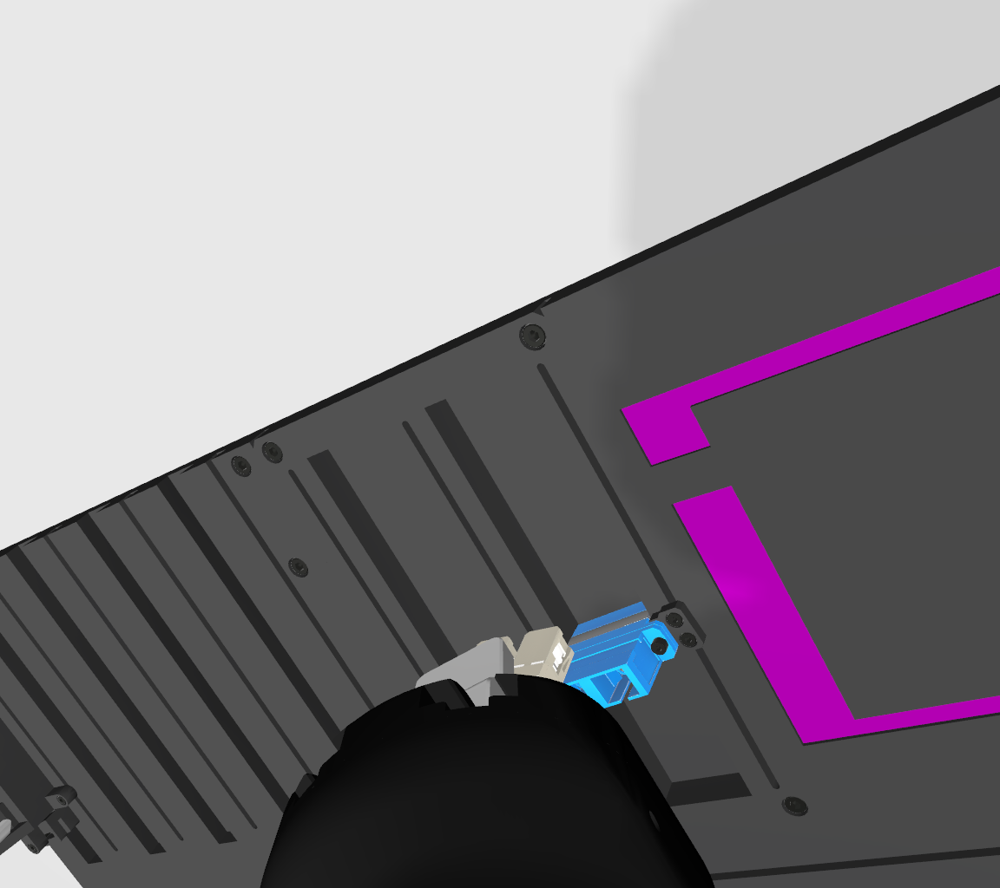 | 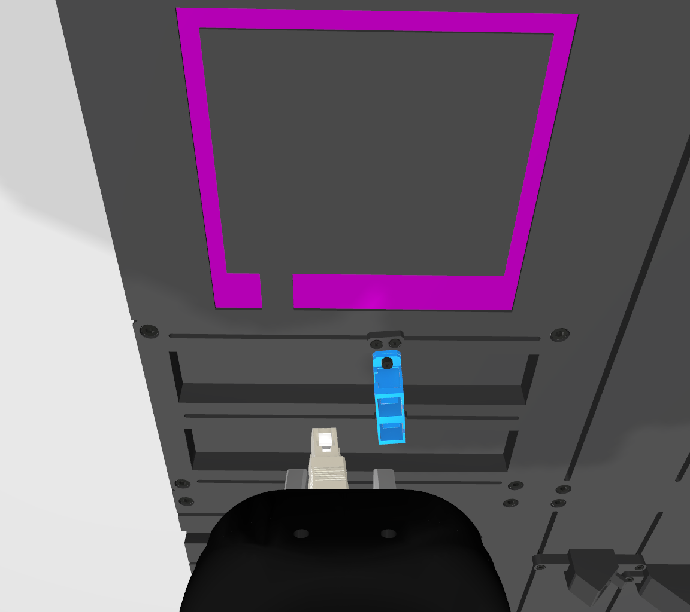 | 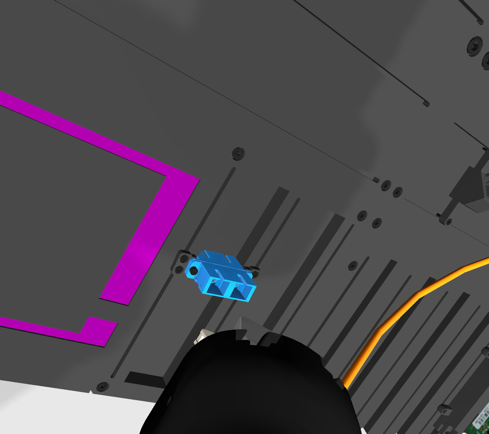 |

Before writing, `third_observation` compares the MD5 of decoded full-res BGR per camera to the MD5 triple captured when `second_observation` wrote `second_observation_bgr.png`. Matching cameras are treated as stale (same logic as second vs first in `second_observation`): log, `sleep_for(0.05)`, one fresh `get_observation()`, then proceed even if a camera still matches.

## 5.2 Downscaling

Same ordering as section **3.2**: `_dump_scaled_hsv_h_turbo_multiview` runs before `_bgr_quarter_views` in `third_observation`, each scaling independently from the full snapshot. Quarter BGR into `RectangleVision` (`original_<camera>.png` under observation `3`). With `image_scale=1.0`, only `segmentation_mask_<camera>.png` is emitted for the mask (no redundant `segmentation_mask_downscaled_<camera>.png`).

| Left | Center | Right |
|------|--------|-------|
|  | 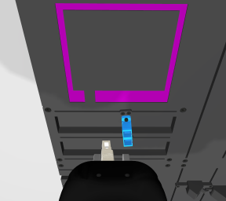 | 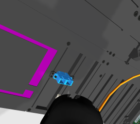 |

## 5.3 Rectangle Segmentation

`RectangleVision` runs blue-port segmentation on the quarter BGR from **§5.2**.

### HSV H Turbo

`TaskBoardVision._dump_scaled_hsv_h_turbo_multiview` resizes each **full** BGR view with `ImageScaler(0.25)` (preview only), converts with `BgrToHsvConverter`, maps the **H** channel (OpenCV range **0–179**) to **0–255** and applies `COLORMAP_TURBO`, writing `third_observation_hsv_h_turbo.png` and a raw three-channel `third_observation_hsv.png` beside each BGR dump. Blue-port segmentation is driven by **hue** on the **quarter BGR** passed to `RectangleVision`; this preview matches that scale (still **0.25** from full resolution for file size).

| Left | Center | Right |
|------|--------|-------|
| 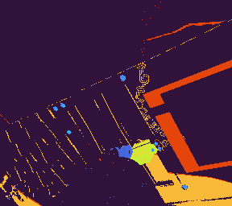 | 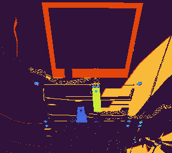 | 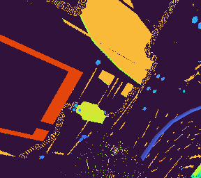 |

### H thresholding + post-processing before the segmentation masks

`SegmentationMode.BLUE_SC_PORT` thresholds the **H** (hue) channel only (**`BLUE_SC_PORT_FILTER`**: **`h_min=94`**, **`h_max=111`**; full **S** and **V** range), then runs connected-component selection and morphological post-processing so the boolean masks below match what `RectangleVision` feeds to the initializer and classifier.

Policy-written `input/third_observation_blue_port_mask.png` files are the masks from the **first** yaw seed’s run on the third pass.

| Left | Center | Right |
|------|--------|-------|
| 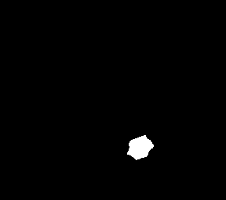 | 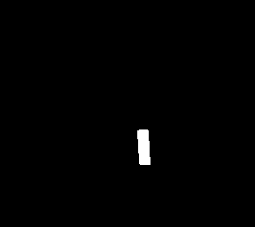 | 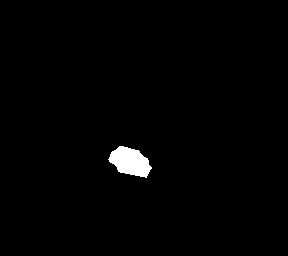 |

## 5.4 Rectangle Initializer

Same `RectangleInitializer` table-plane centroid merge as section **1.4**, using blue-port masks and **TF-derived** `T_cam_from_base` from `_resolve_multiview_cam_extrinsics` (no static wrist fallback). The table height passed into `RectangleVision` is **`z_face_in_base()`**—the **same** nominal task-board top as observations **1** and **2**—not :func:`vision.rectangle3d_detector.z_face_sc_port_on_task_board_stack_m` (board top plus SC mesh **z** extent). That keeps the horizontal plane at the **lowest** board-frame **z** used elsewhere; blue segmentation can pick up **side** surfaces of the port, so we do **not** raise the plane by the SC AABB **z**.

**Blue SC port only:** :class:`RectangleInitializer` uses **center camera** masks only (`initializer_camera_indices=(1,)` in `(left_camera, center_camera, right_camera)` order); left and right still run **segmentation** and appear in dumps and multiview footprint charts.

**Plane `z` for initializer + footprint chart (observation 3):** **`z_face_in_base()`** — same scalar as **§1.4** / **§3.4** (:data:`vision.rectangle3d_detector.TASK_BOARD_TOP_FACE_AABB` **`z_top`**).

**Extrinsics:** **`T_cam_from_base`** from `_resolve_multiview_cam_extrinsics(observation, "third")` → **`third_observation_extrinsics.json`**.

**Initializer-only top view:** **`multiview/3/xy_top_view_initializer_footprints_only.png`** (footprints + magenta × = initializer **merged** centroid on `z_face`; with center-only initializer masks this equals the single center-camera mask mean; last yaw overwrites).

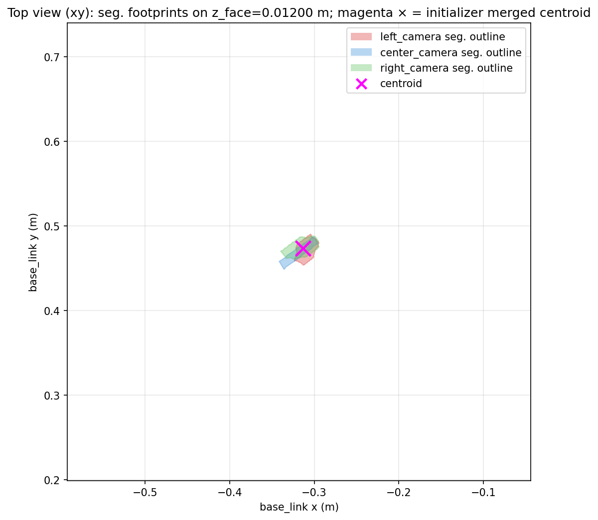

## 5.5 Rectangle Classifier

Same two-pass `RectangleClassifier` fit, with **SC-port** half-extents on both axes from **`sc_port_rectangle_half_extents_xy_m()`** (see **§5** intro), not the **0.05 m** logo box used on observation **2**. **Blue SC port only:** the optimizer uses **center camera** masks only (`classifier_camera_indices=(1,)` on `RectangleVisionInput`); **initializer** also uses the **center** view only for centroiding (see **§5.4**). Left and right still run **segmentation** for masks and PNG dumps. `mean_hard_iou` on third-observation candidates is the center-view classifier metric (multiview top-view PNGs still draw all three footprints).

Multiview footprint and fitted rectangle in the table plane (dump `xy_top_view_visible_by_camera.png`) for each yaw initializer:

| yaw seed = π | yaw seed = π/2 |
|----------------|----------------|
| 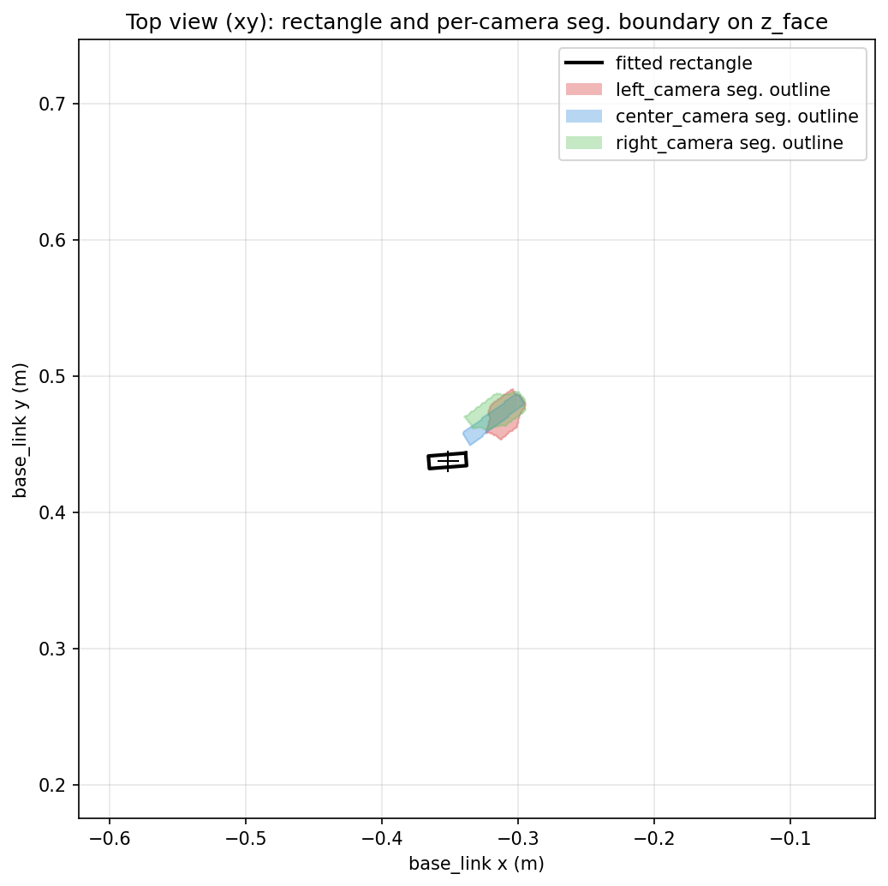 | 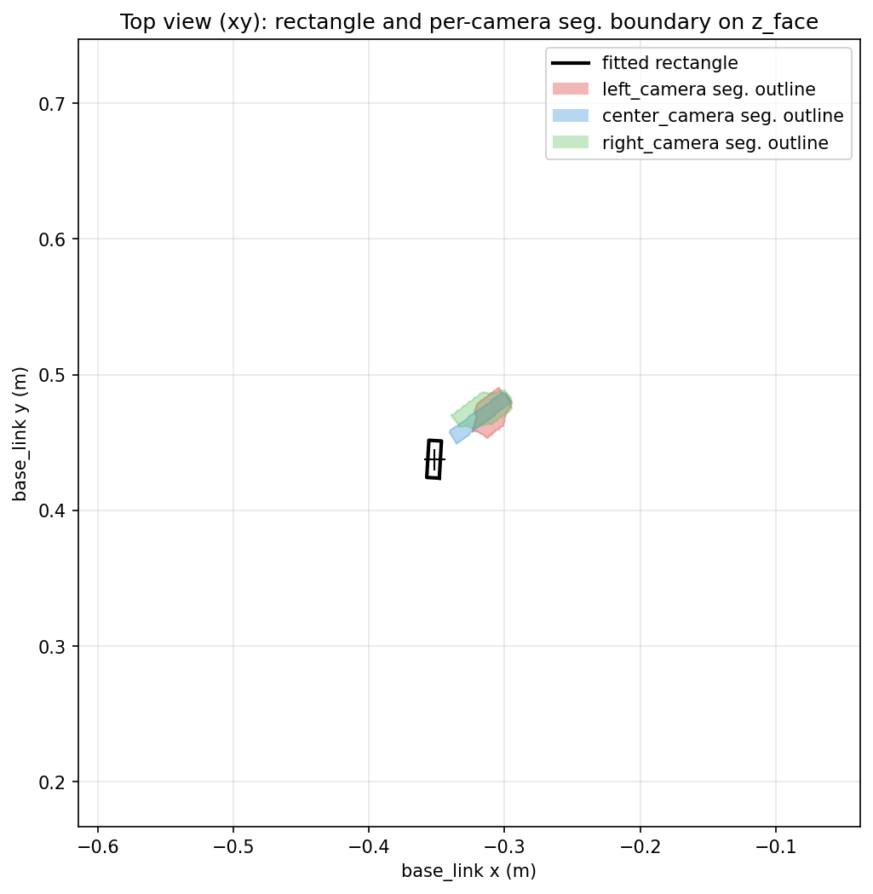 |

| | yaw seed = π | yaw seed = π/2 |
|--|--------------|----------------|
| Left | 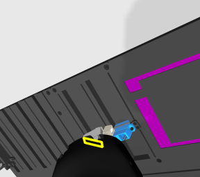 | 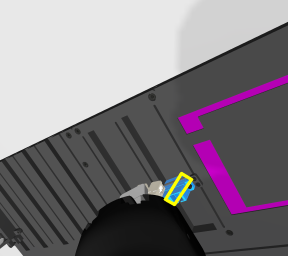 |
| Center | 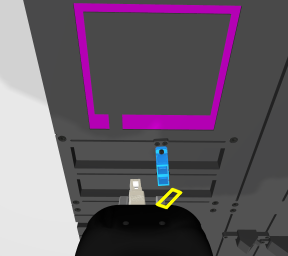 | 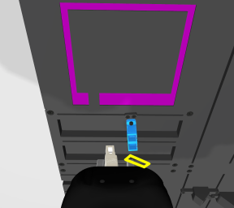 |
| Right | 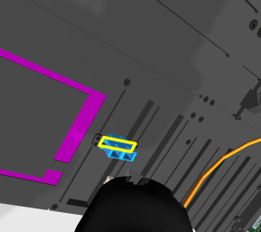 | 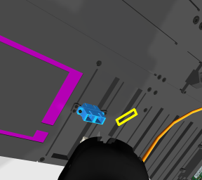 |

## 5.6 Classifier optimization trajectory

Same trajectory dump layout as section **1.6**, under `multiview/3/<yaw_slug>/`.

| yaw seed = π | yaw seed = π/2 |
|----------------|----------------|
| 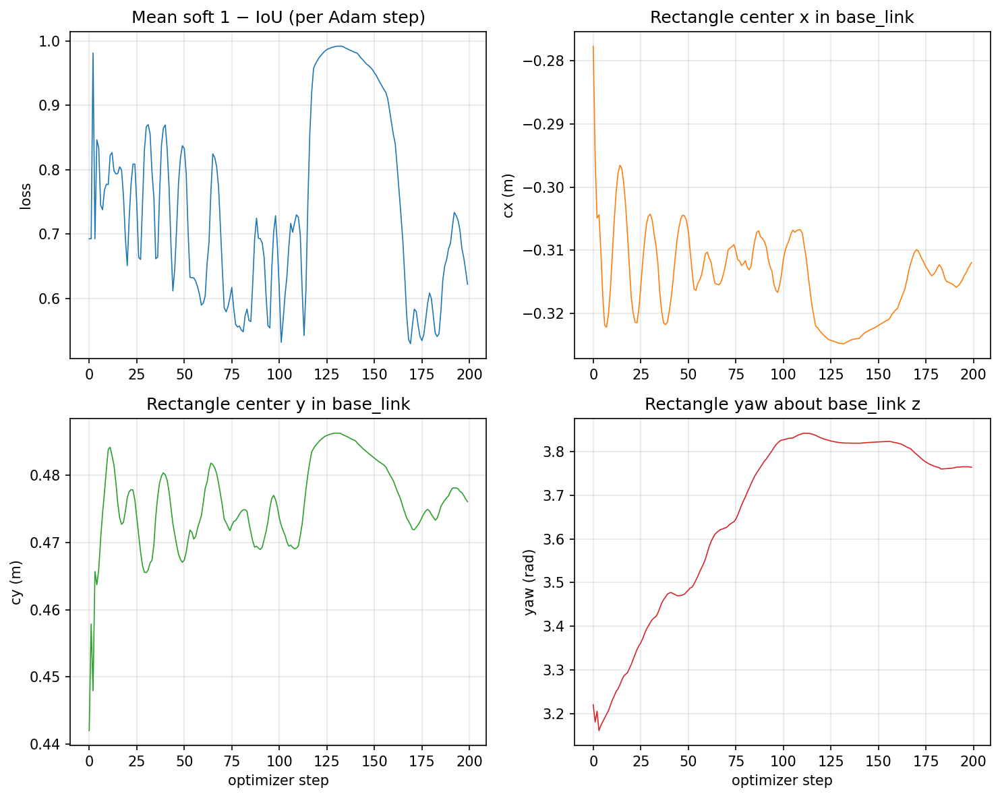 | 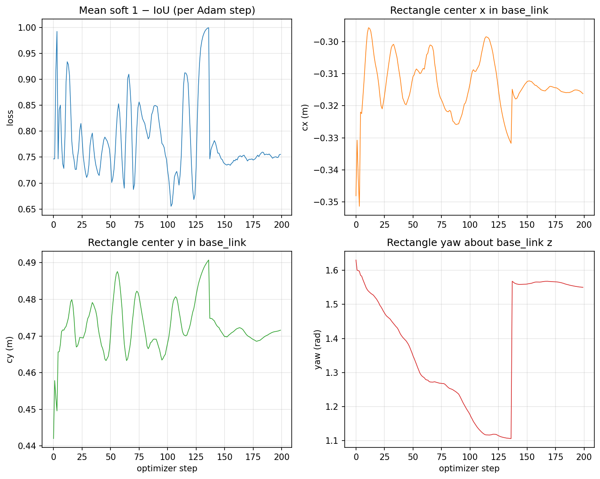 |
